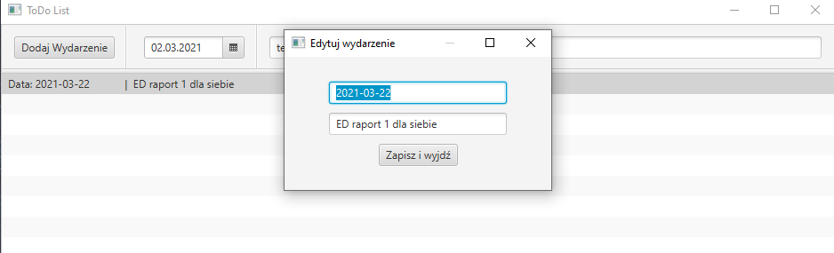

# ToDo list
>Simple ToDo list written in java with help of javafx.

## Table of contents
* [General](#general)
* [Screenshots](#screenshots)
* [Techstack](#techstack)
* [Features](#features)
* [VM options](#vm_options)
* [Status](#Status)
* [Contact](#Contact)
## General
This list helps to track my duties and order my tasks.

## Screenshots

  
  
  

## Techstack:
- JDK 11
- Maven
- JavaFX

## Features
* Add, modify, delete events
* Set deadline date to events

## Vm_options

--module-path "path-to-your-javafx" --add-modules=javafx.controls,javafx.fxml

## Status
This project will be updated in the future.

## Contact
Feel free to contact if you have any question
* email: mmichal1999@gmail.com
* github: https://github.com/bearyogi/